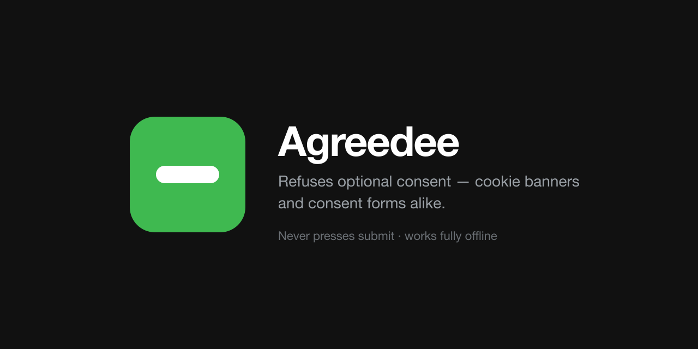

<p align="center">
  
</p>

<p align="center">
  <b>Websites ask you to agree to things. Agreedee answers for you —<br>
  refusing what is optional, keeping what is required, and never pressing submit.</b>
</p>

<p align="center">
  
  
  
  
</p>

---

## What it does

Consent shows up in two shapes, and Agreedee handles both.

**Cookie banners.** It presses the refusal control — `Reject all`, `Only
necessary`, `필수만 동의` — and only that one. Never `Accept`, never `Manage`,
never anything that could submit a form.

**Consent checkboxes** in signup, checkout and event forms. It unticks
everything not proven required, and reports what the form got wrong: items
pre-ticked before you arrived, a bulk-consent box that contradicts the
individual ones, a label whose terms say something else.

It acts **before** asking an AI anything, so a slow model costs accuracy and
never safety. The model refines afterwards — it can restore a box it proves is
genuinely required — but it is never on the critical path.

A badge appears when there is something to say. Right-click any page for the
current status, a re-check, and settings.

## Install

Requires Node 22.18+ and pnpm 10+.

```bash
git clone https://github.com/imsungbin/agreedee && cd agreedee
pnpm install
pnpm build
```

Then `chrome://extensions` → **Developer mode** → **Load unpacked** → select
**`dist/`**, not the repository root.

## Safety

The two failure modes are not symmetric, and every rule follows from that:

| Failure | Result | Recovery |
| --- | --- | --- |
| Missed something you had to agree to | Form won't submit; banner stays up | One click |
| Agreed to something you didn't want | Your data is gone | **Impossible** |

So **when uncertain, refuse.** In practice:

- **Never submits.** No form submission, ever, from any module.
- **Presses only what is provably a refusal.** A button's own label must say so
  and say nothing that contradicts it. `Accept only necessary` is a refusal;
  `I accept — reject optional` is not understood, so it is left alone.
- **Never presses anything that could submit.** A `<button>` inside a form with
  no explicit `type="button"` is a submit button, whatever its label says.
- **Reads the label again immediately before pressing.** Banners re-render, and
  that is exactly how `Reject all` becomes `Accept all` in between.
- **The AI never decides what a button does**, for the same reason it never
  decides law. Button classification is deterministic and offline.

→ [Safety contract](docs/safety.md)

## Where it is strongest

Korean forms print the answer: every consent item is marked **required**
(`필수`) or **optional** (`선택`), and refusing an optional item may not cost
you the service. Where that mark exists, Agreedee reads it and nothing has to
be inferred.

Elsewhere there is no such mark, so it leans on the banner path and on the terms
text, and reports rather than acts when a checkbox is unclear.

→ [Why this works](docs/architecture.md#why-this-is-tractable)

## Judgement engine

The AI has one narrow job: reading whether an item's linked terms *contradict*
its label. Pick where that runs — or skip it entirely.

| | Covers | Key | Leaves your machine |
| --- | --- | --- | --- |
| **No key** | — | none | **nothing** |
| **Ollama** | Ollama | none | **nothing** |
| **OpenAI-compatible** | OpenAI, LM Studio, vLLM, llama.cpp, OpenRouter, Groq | optional | depends on the address |
| **Anthropic** | Claude | required | label + terms text |

Extension **Details → Extension options**, then **Test connection**. That check
matters: a rejected key or an unpulled model fails silently everywhere else —
the extension just degrades and refuses more than it needed to.

<details>
<summary>Running a local model</summary>

```bash
ollama serve && ollama pull llama3.2      # or any model with structured output
```

For an OpenAI-compatible server, point the base URL at it — `http://localhost:1234/v1`
for LM Studio, `http://localhost:8000/v1` for vLLM. Whether anything leaves your
machine is a property of that address, so the key field is optional.

Local models judge less well, and that is safe rather than merely acceptable:
every quote is verified against the terms text afterwards, so a hallucinated one
is discarded and the item is refused. **A weaker model costs recall, never
correctness.**

</details>

## Privacy

No telemetry, no analytics, no account. Nothing is collected.

Banner handling is entirely local — no model is ever consulted about a button.

For checkboxes with a hosted engine, each consent moment sends **one request**
carrying, per item: the label, its printed mark, and that item's terms text. Not
the page, not the URL, not your form input, not cookies. With Ollama — or an
OpenAI-compatible server on localhost — nothing leaves the machine at all.

Your API key lives in `chrome.storage.local`, is never logged, and never appears
in a URL.

## Development

```bash
pnpm test         # node --test, no framework, no watch mode
pnpm typecheck    # tsc over src, tests and tools
pnpm score        # golden-set metrics; exits non-zero if anything was wrongly agreed to
pnpm icons        # regenerate PNGs from the SVG sources
```

Tests run straight from the `.ts` sources, and `erasableSyntaxOnly` keeps the
emitted JavaScript identical to the source with its types removed — so there is
no question of testing something other than what ships.

→ [Architecture](docs/architecture.md) · [Golden set](docs/golden-set.md) · [Design](docs/design.md)

## Limits

- **No fixture has been captured from a live site.** Every one is reconstructed
  from documented patterns, so the scores describe internal consistency, not
  field accuracy.
- **Banners are found structurally**, not from a list of vendor ids. A consent
  platform that renders nothing dialog-shaped and nothing pinned is missed.
- **A banner with two refusal controls is left alone** — the shape is not what
  we think it is, and pressing either would be a guess.
- **Canvas or image-rendered UI** and **cross-origin iframes** are invisible.
- **Login-gated terms** cannot be fetched, so those items are refused.
- It reports what a page printed and what its terms said. **It is not legal
  advice.**

## Contributing

Real captures are the highest-value contribution — see
[Growing the golden set](docs/golden-set.md#growing-the-golden-set). Anonymise
first, and read `page.html` yourself before committing.
